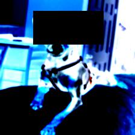
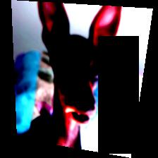
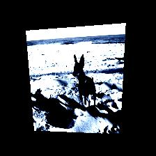
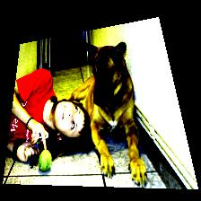
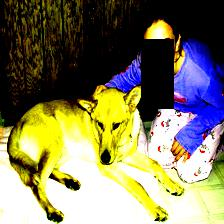
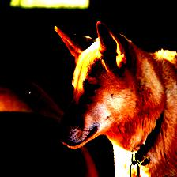
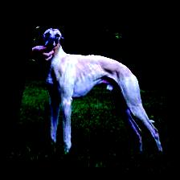
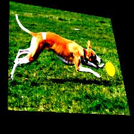
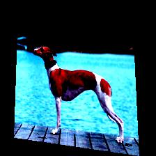
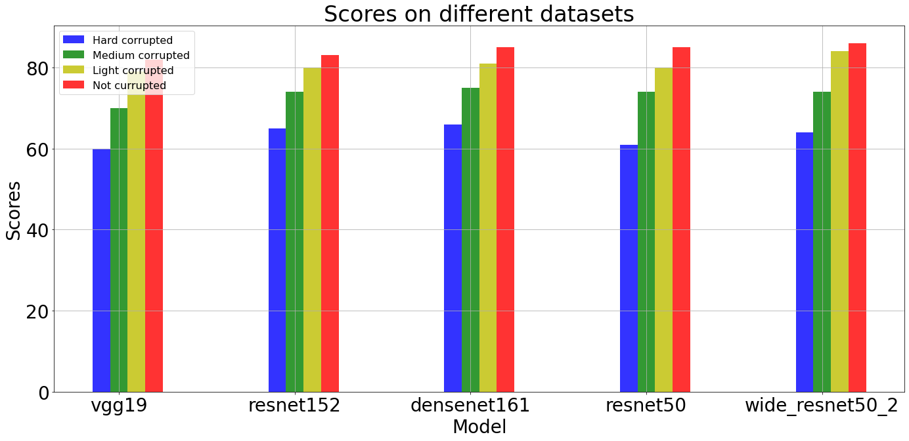

## Первый этап - обучение на "испорченной выборке"

#### Данные:

- 50 классов
- 5374 объектов в тесте
- 627 объектов для валидации
- 1165 в тестовой выборке


#### Аугментирование для данных:

1. Самое сильное аугментирование - в этом пункте в процессе обучения используются эти аугментации (тестирование проводится с использованием разных аугментаций)
```
hard_corrupted = transforms.Compose([
          transforms.ToTensor(),
          transforms.ToPILImage(),
          transforms.GaussianBlur(kernel_size=9),
          transforms.RandomGrayscale(0.3),
          transforms.RandomHorizontalFlip(),
          transforms.ColorJitter(0.1,0.1,0.1,0.1),
          transforms.RandomPerspective(),
          transforms.RandomInvert(p=0.3),
          transforms.ToTensor(),
          transforms.RandomErasing(),
          transforms.Normalize([0.485, 0.456, 0.406], [0.229, 0.224, 0.225])]) 
```
Пример выхода:








2. "Средняя степень испорченности"

```
medium_corrupted = transforms.Compose([
          transforms.ToTensor(),
          transforms.ToPILImage(),
          transforms.RandomPerspective(),
          transforms.ColorJitter(0.1,0.1,0.1,0.1),
          transforms.RandomHorizontalFlip(),
          transforms.ToTensor(),
          transforms.RandomErasing(),
          transforms.Normalize([0.485, 0.456, 0.406], [0.229, 0.224, 0.225])])
```
Пример выхода:







3. "Легкая степень испорченности":

```
light_corrupted = transforms.Compose([
          transforms.ToTensor(),
          transforms.ToPILImage(),
          transforms.ColorJitter(0.1,0.1,0.1,0.1),
          transforms.RandomHorizontalFlip(),
          transforms.RandomPerspective(),
          transforms.ToTensor(),
          transforms.Normalize([0.485, 0.456, 0.406], [0.229, 0.224, 0.225])])
```

Пример выхода:







#### Используемые модели:

- VGG19
- Resnet152
- Densenet161
- Resnet50
- Wide_resnet50_2


#### Параметры обучения

- Шаг обучения lr=0.00005
- Оптимизатор AdamW

#### Результаты обучения

| Модель        | "Степень испорченности"   | F1    |
| ------------- |:-------------------------:| -----:|
| VGG19         | hard_corrupted            | 0.608 |
| VGG19         | medium_corrupted          | 0.708 |
| VGG19         | light_corrupted           | 0.792 |
| VGG19         | not_corrupted             | 0.819 |
| Resnet152     | hard_corrupted            | 0.654 |
| Resnet152     | medium_corrupted          | 0.736 |
| Resnet152     | light_corrupted           | 0.797 |
| Resnet152     | not_corrupted             | 0.830 |
| Densenet161   | hard_corrupted            | 0.660 |
| Densenet161   | medium_corrupted          | 0.751 |
| Densenet161   | light_corrupted           | 0.807 |
| Densenet161   | not_corrupted             | 0.848 |
| Resnet50      | hard_corrupted            | 0.613 |
| Resnet50      | medium_corrupted          | 0.739 |
| Resnet50      | light_corrupted           | 0.799 |
| Resnet50      | not_corrupted             | 0.850 |
| Wide_resnet   | hard_corrupted            | 0.642 |
| Wide_resnet   | medium_corrupted          | 0.742 |
| Wide_resnet   | light_corrupted           | 0.836 |
| Wide_resnet   | not_corrupted             | 0.859 |





##### Безошибочно определенные классы для каждой модели для неиспорченного датасета

| Модель        | Классы                        |    
| ------------- |:-----------------------------:| 
| VGG19         | 4, 9, 29, 36, 38              | 
| Resnet152     | 13, 29, 32                    | 
| Densenet161   | 1, 17, 27, 28, 32, 36, 38, 48 | 
| Resnet50      | 14, 22, 17, 36, 48            | 
| Wide_resnet   | 1, 3, 5, 14, 17, 27, 29, 30, 32, 35, 40, 48 | 

##### 5 наиболее плохо определенных классов для каждой модели

| Модель        | Классы                        |    
| ------------- |:-----------------------------:| 
| VGG19         | 1, 21, 23, 41, 46             | 
| Resnet152     | 23, 28, 41, 44, 46            | 
| Densenet161   | 7, 8, 11, 23, 44              | 
| Resnet50      | 7, 23, 24, 25, 41             | 
| Wide_resnet   | 23, 31, 41, 44, 45            | 


## Второй этап - обучение на "хорошей выборке"

##### Данные
Исходный датасет был обрезан

|               Выборка               |            Размер             |    
| ----------------------------------- |:-----------------------------:| 
| **train_dataset_not_corrupted**     | 2687                          | 
| **val_dataset_not_corrupted**       | 313                           | 
| **test_dataset_not_corrupted**      | 1165                          | 
| train_dataset_hard_corrupted.       | 5374                          | 
| val_dataset_hard_corrupted          | 627                           |
| test_dataset_hard_corrupted         | 1165                          |

##### Результаты на неиспорченной выборке

| Модель            | Качество                      |    
| ----------------- |:-----------------------------:| 
| VGG19             | 0.83                          | 
| Resnet152         | 0.82                          | 
| Densenet161       | 0.87                          | 
| Resnet50          | 0.85                          | 
| **Wide_resnet**   | **0.88**                      | 

##### Результаты на испорченной выборке

| Модель            | Качество                      |    
| ----------------- |:-----------------------------:| 
| VGG19             | 0.34                          | 
| Resnet152         | 0.32                          | 
| Densenet161       | 0.37                          | 
| Resnet50          | 0.37                          | 
| **Wide_resnet**   | **0.40**                      |

##### Пять наиболее успешно определенных классов для каждой модели (испорченная выборка)

| Модель        | Классы                                             |    
| ------------- |:--------------------------------------------------:| 
| VGG19         | 34 (77%), 38 (75%), 37 (67%), 19 (65%), 48 (65%)   | 
| Resnet152     | 46 (65%), 28 (56%), 32 (56%), 11 (55%), 31 (55%)   |                    | 
| Densenet161   | 19 (78%), 46 (75%), 47 (74%), 18 (73%), 27 (71%)   | 
| Resnet50      | 19 (78%), 12 (70%), 28 (69%), 44 (67%), 47 (65%)   | 
| Wide_resnet   | 34 (88%), 28 (75%), 8 (73%), 16 (69%), 47 (69%)    | 

##### Пять наименее успешно определенных классов для каждой модели (испорченная выборка)

| Модель        | Классы                                             |    
| ------------- |:--------------------------------------------------:| 
| VGG19         | 26 (12%), 30 (12%), 9 (11%), 17 (5%), 11 (3%)      | 
| Resnet152     | 26 (8%), 45 (7%), 39 (5%), 17 (5%), 9 (4%)         | 
| Densenet161   | 43 (17%), 45 (14%), 15 (12%), 17 (10%), 23 (10%)   | 
| Resnet50      | 30 (16%), 32 (16%), 9 (15%), 45 (14%), 17 (10%)    | 
| Wide_resnet   | 43 (17%), 10 (15%), 23 (10%), 15 (8%), 26 (8%)     | 
